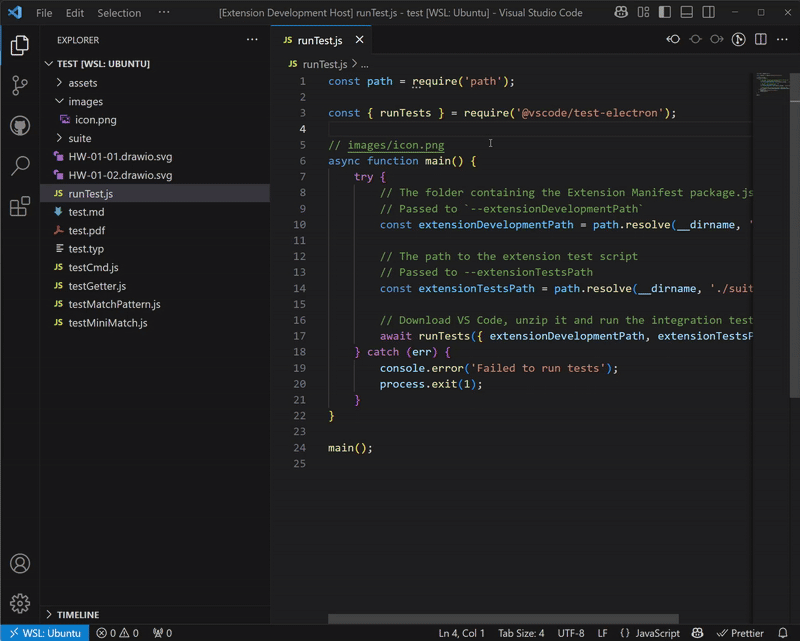

# clickable-image-comment README

Transform image paths in comments into clickable links for seamless navigation and preview.

# Overview

Clickable Image Comment is a productivity tool developed for Team Monolith frontend team. It automatically detects image paths in code comments and converts them into clickable links, enabling quick access to component visualizations during development and code review.

When you click on an image path in a comment, the extension resolves the path relative to your workspace and opens the image file directly in VS Code.

# Features

- **Automatic Link Detection**: Detects image paths in code comments across all file types
- **Clickable Navigation**: Transforms detected paths into clickable links
- **Multiroot Workspace Support**: Resolves paths relative to the workspace root
- **Cross-Platform Compatible**: Optimized for macOS and WSL environments

# Why We Built This

At Team Monolith, we document our UI components with embedded image references in code comments. This extension is part of our toolkit to enhance visualization and improve developer experience.

This tool works especially well when combined with:
- [Image Preview](https://marketplace.visualstudio.com/items?itemName=kisstkondoros.vscode-gutter-preview)
- [Markdown Paste Enhanced](https://marketplace.visualstudio.com/items?itemName=dzylikecode.md-paste-enhanced)

With this toolset, we've observed:
- 10-20% improvement in code review productivity
- 10-20% reduction in onboarding time for new developers

## Release Notes

### 1.0.0

Initial release with basic functionality:
- Image path detection in comments
- Clickable link conversion
- Cross-platform path resolution

---

**Developed for Team Monolith**